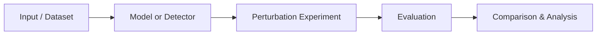

# 🛡️ DeepShield

<p align="center"></p>

<p align="center"><b>Deep-learning based experimentation for detecting and evaluating adversarial perturbations.</b></p>

<p align="center">  </p>

## ✨ Overview
DeepShield is a research-oriented Python project containing detection, perturbation-generation and comparison utilities for deep-learning experiments. The repository combines a main Jupyter notebook with reusable Python modules for detector experiments and GAN-based perturbations.

## 🧩 Repository Structure
| File | Purpose |
|---|---|
| `Deepshield_main1.ipynb` | Main experimental notebook and workflow |
| `Detector3.py` | Detection-related implementation |
| `GAN_pertubations2.py` | GAN-based perturbation experiments |
| `comparision4.py` | Comparison/evaluation utilities |
| `utilites1.py` | Supporting helper functions |

## 🔬 Conceptual Workflow


## 🚀 Getting Started
```bash
git clone https://github.com/Abhishek7258/Deepsheild.git
cd Deepsheild
python -m venv .venv
# Windows: .venv\\Scripts\\activate
# macOS/Linux: source .venv/bin/activate
pip install -U pip
```

Open `Deepshield_main1.ipynb` with Jupyter Notebook/Lab and run the cells in order. Install the Python packages imported by the notebook/modules if your environment does not already contain them.

## 📊 Experiments
The repository is structured around three useful research activities: detection, perturbation generation, and comparison of experimental outputs. Keep datasets, model weights and generated artifacts outside Git when they are large.

## ⚠️ Research Note
Results depend on the dataset, model, preprocessing and runtime environment used for each experiment. This repository should be treated as an experimental/research codebase rather than a production security system.

## 🤝 Contributing
Improvements to reproducibility, documentation, experiment configuration and evaluation are welcome. Please describe the experiment and environment when submitting changes.

## 📄 License
No license file is currently declared in the repository. Add a license before distributing or reusing the project publicly.

<p align="center">Built for experimentation, evaluation and learning in deep learning.</p>